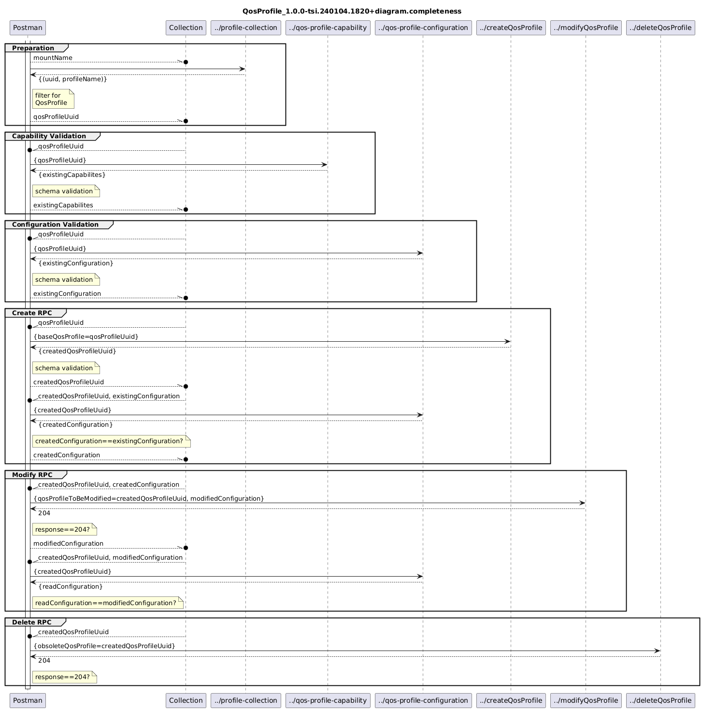

# QosProfile_1.0.0-tsi.240104.1820+validator  

### Completeness
- [QosProfile_1.0.0-tsi.240104.1820+validator.completeness](./Completeness/QosProfile_1.0.0-tsi.240104.1820+validator.completeness.json)  
- [QosProfile_1.0.0-tsi.240104.1820+data.completeness](./Completeness/QosProfile_1.0.0-tsi.240104.1820+data.completeness.json)  
-   